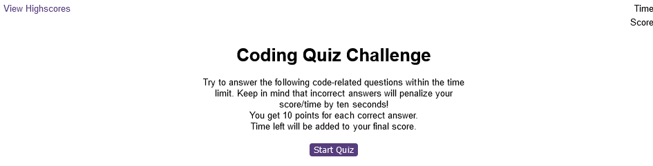
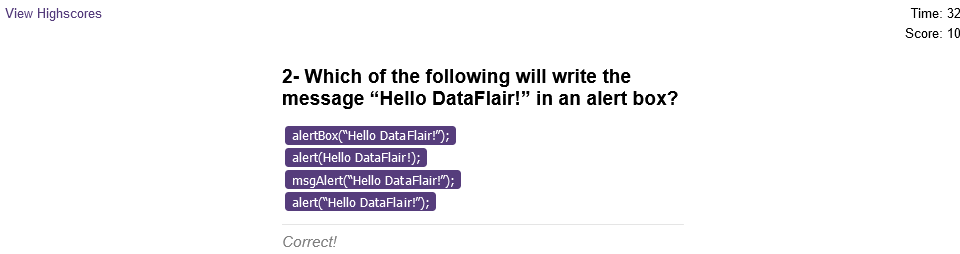

# Javascript Quiz Game

## Description

This is a Javascript Quiz to test your basic knowledge. The Quiz is a timed multuple choice questions.
there is a time limit and a pinality for wrong answers.

## Table of Contents

- [Installation](#installation)
- [Usage](#usage)
- [Deployed application](#deployed-application)
- [Screen Shot](#screenshot)
- [Technologies Used](#technologies-used)
- [Credits](#credits)
- [License](#license)

## Installation

N/A

## Usage

Open the index.html file in your browser,or simply click on the live link of the deployed application. 

You will be presented with the Quiz page, read the instructions and click the start button when ready.

The score and the time are displayed in the top right corner of the page.

The quiz will end when you run out of time or you answer all the question. You score will show and you will be invited to enter your initials.

Your initials and score will be added and saved in the leaderboard list.

## Deployed application
[Link to the deployed website](https://kamel-beloula.github.io/JS-Quiz/)

## Screenshot

## Technologies Used

- HTML
- CSS
- Javascript

## Credits

Trilogy Education Services Frontend Web Development bootcamp website.  

## License

MIT License

Copyright (c) 2022 kamel beloula

Permission is hereby granted, free of charge, to any person obtaining a copy of this software and associated documentation files (the "Software"), to deal in the Software without restriction, including without limitation the rights to use, copy, modify, merge, publish, distribute, sublicense, and/or sell copies of the Software, and to permit persons to whom the Software is furnished to do so, subject to the following conditions:

The above copyright notice and this permission notice shall be included in all copies or substantial portions of the Software.

THE SOFTWARE IS PROVIDED "AS IS", WITHOUT WARRANTY OF ANY KIND, EXPRESS OR IMPLIED, INCLUDING BUT NOT LIMITED TO THE WARRANTIES OF MERCHANTABILITY, FITNESS FOR A PARTICULAR PURPOSE AND NONINFRINGEMENT. IN NO EVENT SHALL THE AUTHORS OR COPYRIGHT HOLDERS BE LIABLE FOR ANY CLAIM, DAMAGES OR OTHER LIABILITY, WHETHER IN AN ACTION OF CONTRACT, TORT OR OTHERWISE, ARISING FROM, OUT OF OR IN CONNECTION WITH THE SOFTWARE OR THE USE OR OTHER DEALINGS IN THE SOFTWARE.
